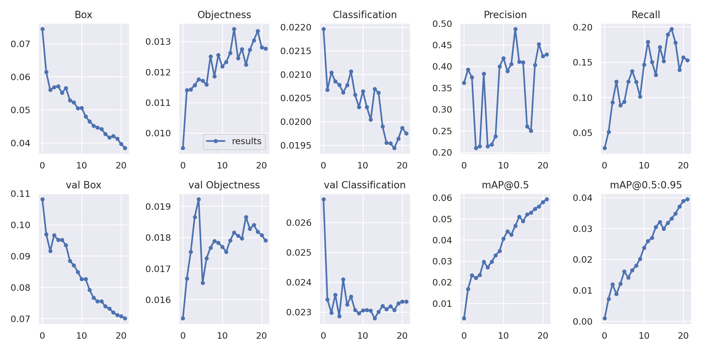

# Course CS236781: Deep Learning Final Mini Project

## You can find the full project assignment [here](Full-Project-Assignment.ipynb).

## The Guidelines as given:
>
>
>In this part you'll implement a small comparative-analysis project, heavily based on the materials from the tutorials and homework.
>- You should implement the code which displays your results in this notebook, and add any additional code files for your implementation in the `project/` directory. You can import these files here, as we do for the homeworks.
>- Running this notebook should not perform any training - load your results from some output files and display them here. The notebook must be runnable from start to end without errors.
>- You must include a detailed write-up (in the notebook) of what you implemented and how. 
>- Explain the structure of your code and how to run it to reproduce your results.
>- Explicitly state any external code you used, including built-in pytorch models and code from the course tutorials/homework.
>- Analyze your numerical results, explaining **why** you got these results (not just specifying the results).
>- Where relevant, place all results in a table or display them using a graph.
>
>
>
## The Projects Goals

>
>
>* You need to perform Object Detection task, over 7 of the dataset.
>* The annotation for object detection can be downloaded from here: https://github.com/wimlds-trojmiasto/detect-waste/tree/main/annotations.
>* The data and annotation format is like the COCOAPI: https://github.com/cocodataset/cocoapi (you can find a notebook of how to perform evalutation using it here: https://github.com/cocodataset/cocoapi/blob/master/PythonAPI/pycocoEvalDemo.ipynb)
>(you need to install it..)
>* if you need a beginner guild for OD in COCOAPI, you can read and watch this link: https://www.neuralception.com/cocodatasetapi/ 
>
>
# Our Implementation

This is the Implementation my partener to this project [dorin133](https://github.com/dorin133) and I decided go with. 

The code place in [Taco-Trash-Detection](Taco-Trash-Detection.ipynb).

You can clone the project in [colab](https://colab.research.google.com) and run it there if you dont have a powerful enough computer.

## Results

1. Adam

Model prediction | Actual Lables
---|---
 |  
 |  
 |  
---
2. SGD
    

Model prediction | Actual Lables
---|---
 |  
 |  
 |  

---
3. SGD - IOU 0.45

Model prediction | Actual Lables
---|---
 |  
 |  
 |  

---
4. Lion

Model prediction | Actual Lables
---|---
 |  
 |  
 |  